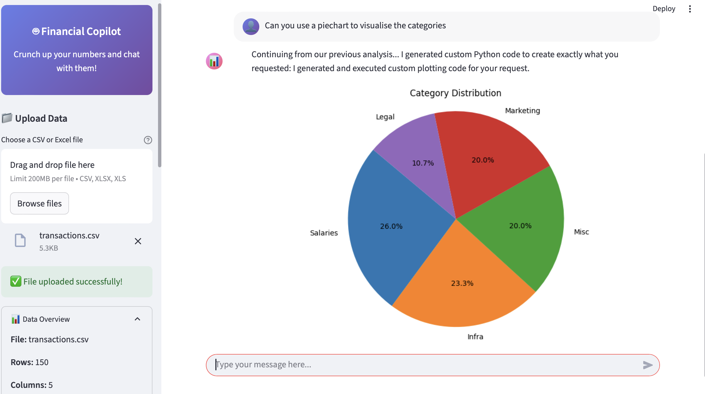
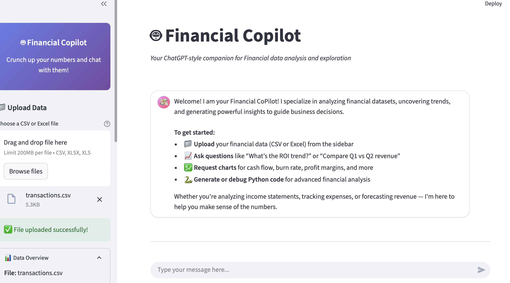

# Finance Multi-Agent Analytics System

A robust, intelligent multi-agent system for comprehensive **financial data analytics** with context-aware query routing, dynamic chart generation, and flexible financial data exploration. Built with LangGraph, LangChain, and Streamlit.

## Overview

This platform leverages a sophisticated swarm of specialized agents, orchestrated to deliver advanced **financial analytics** for any structured dataset:

* **Router Agent**: Intelligently classifies and routes financial queries to the right specialist agents

* **Query Context Agent**: Expands financial abbreviations, maps terms to columns, and provides context hints

* **Memory Agent**: Maintains financial conversation context and session management

* **Pandas Agent**: Performs DataFrame operations, statistics, and financial data analysis

* **Charting Agent**: Creates dynamic financial visualizations with LLM-driven code generation

* **Data Search Agent**: Context-aware searching, filtering, and financial data exploration

* **Coordinator Agent**: Orchestrates multi-agent workflows and aggregates results

## Key Features

### 🧠 Intelligent Financial Query Understanding

* **Context-Aware Routing**: Automatically routes financial queries to the most appropriate agent(s)

* **Abbreviation Expansion**: Understands financial terms like "EBITDA", "ROI", "COGS", etc.

* **Column Mapping**: Maps query terms to actual financial dataset columns

* **Domain Agnostic**: Works with any financial CSV/Excel dataset structure

### 📊 Dynamic Financial Visualization

* **LLM-Driven Chart Generation**: Creates custom Python code for any financial visualization request

* **Adaptive Chart Types**: Analyzes financial data structure to suggest appropriate charts

* **Base64 Image Output**: Seamless integration with web interfaces

* **Chart Types**: Bar, line, scatter, histogram, box, pie, heatmap, violin plots, and custom financial visualizations





### 🔍 Powerful Financial Data Exploration

* **Context-Enhanced Search**: Uses query context for more accurate financial results

* **Flexible Filtering**: Supports all comparison operators and text matching for financial data

* **Statistical Analysis**: Comprehensive DataFrame operations and financial insights

* **Multi-Step Reasoning**: Chains multiple operations for complex financial analysis

### 💭 Conversation Memory

* **Session Persistence**: Maintains financial context across interactions

* **Chat-Style Interface**: Natural conversation flow for financial analysis

* **Query History**: Learns from previous financial queries

* **Multi-Turn Conversations**: Supports follow-up questions and refinements



## Quick Start

### 1\. Install Dependencies

```bash
pip install -r requirements.txt
```

### 2\. Set Environment Variables 

```bash
export OPENAI_API_KEY="your-openai-api-key"
```

### 3\. Run the Streamlit Web Interface

```bash
streamlit run streamlit_app.py
```

### 4\. Or Use Terminal Chat Interface

```bash
python chat_interface.py
```

### 5\. Or Run Demo Conversations

```bash
python demo_chat.py
```